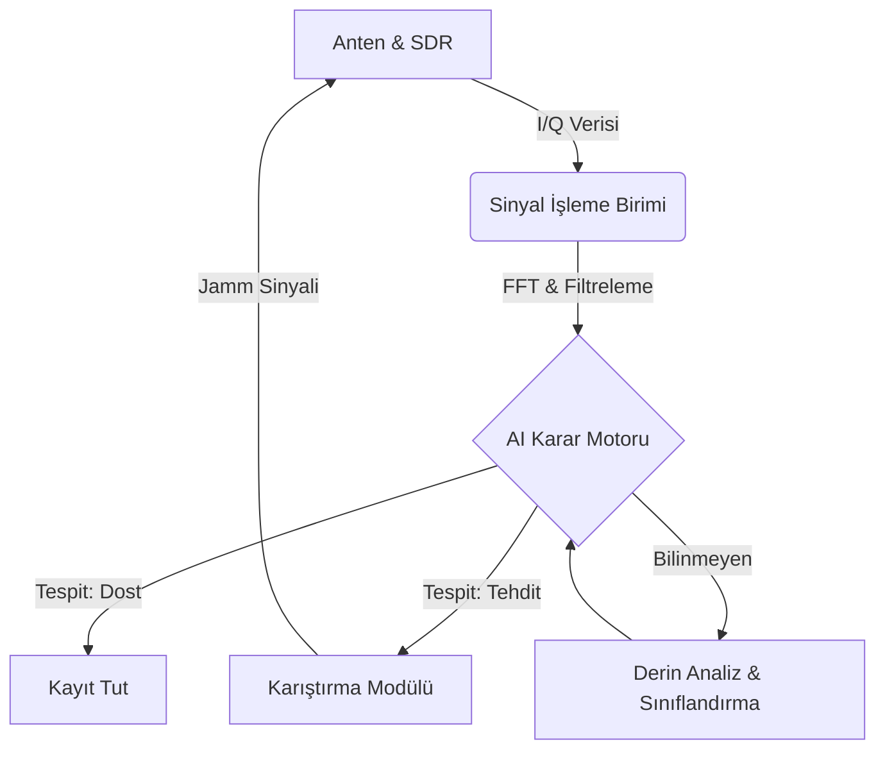

<div align="center">

# 🛰️ Aegis-AI
### Otonom Sinyal İstihbaratı ve Elektronik Taarruz Paketi

[](https://opensource.org/licenses/MIT)
[](https://www.python.org/downloads/)
[]()
[]()

*“Geleceğin savaşlarında spektruma hakim olan, sahaya hakim olur.”*

[Belgeler](docs/) | [Yol Haritası](#-yol-haritası-2026-takvimi) | [İletişim](#-geliştirici-hakkında)

</div>

---

## ⚡ Proje Vizyonu

Aegis-AI, günümüzün karmaşık elektromanyetik spektrumunda operatör üzerindeki yükü azaltmak için otonom çalışma yöntemleri sunan yeni nesil bir **Elektronik Harp (EH)** çözümüdür. 

Bu proje, Türkiye'nin savunma sanayindeki yerli teknoloji hamlesine katkı sunmak amacıyla; sinyal analizlerini yapay zeka ile hızlandıran ve taarruz görevlerini otonomize eden bir mimariyle geliştirilmiştir.

## 🏗️ Sistem Mimarisi



## 🛡️ Modüller ve Yetenekler

| Modül | Özellik | Açıklama |
| :--- | :--- | :--- |
| **🔍 Elektronik Destek (ED)** | **Sinyal Tespiti** | Gürültü tabanını aşan yayınların anlık tespiti. |
| | **AI Sınıflandırma** | Derin öğrenme ile modülasyon ve parametre tahmini. |
| | **Dinleme** | Analog/Sayısal telsiz demodülasyonu. |
| | **Kestirim (DF)** | Sinyal kaynağının yönünü belirleme. |
| **⚔️ Elektronik Taarruz (ET)** | **Akıllı Karıştırma** | Sadece tehdit aktifken devreye giren "Look-through" jamming. |
| | **Spoofing** | GPS ve iletişim sistemlerini yanıltıcı sinyal üretimi. |

## 🛠️ Teknik Altyapı

Bir **Solopreneur** (Geliştirici + Mühendis + Araştırmacı) olarak geliştirdiğim sistem, aşağıdaki disiplinleri bir araya getirmektedir:

*   **DSP (Sayısal Sinyal İşleme):** Python (`scipy`, `numpy`) tabanlı düşük gecikmeli sinyal işleme.
*   **AI & Ajan Sistemleri:** Spektrum yoğunluğuna yetişebilmek için otonom karar destek mekanizmaları.
*   **GUI Tasarımı:** Operasyonel komuta kontrolü için geliştirilen, kullanıcı dostu EH arayüzü.

## 📂 Depo Yapısı

```text
├── src/
│   ├── signal_processing/  # FFT, Demodülasyon ve Filtreleme algoritmaları
│   ├── ai_engine/          # Sinyal sınıflandırma için Derin Öğrenme modelleri
│   ├── jamming_logic/      # ET görevleri için karıştırma/aldatma kodları
│   └── dashboard/          # Kullanıcı Arayüzü (UI) dosyaları
├── docs/
│   ├── Teknik_Yeterlilik/  # TYF dokümantasyonu
│   └── Kritik_Tasarim/     # KTR detayları
├── assets/                 # Görsel materyaller
└── README.md
```

## 🚀 Hızlı Başlangıç

Demo modülünü çalıştırarak temel DSP yeteneklerini test edebilirsiniz:

```bash
# Gerekli kütüphaneleri yükleyin
pip install -r requirements.txt

# Demo senaryosunu çalıştırın
python demo_dsp.py
```

## 📅 Yol Haritası (2026 Takvimi)

- [ ] **Teknik Yeterlilik Formu:** 24.03.2026
- [ ] **Kritik Tasarım Raporu:** 30.04.2026
- [ ] **Sistem Tanımlama Videosu:** 14.07.2026
- [ ] **TEKNOFEST Finali:** Eylül 2026

## 👤 Geliştirici Hakkında

Ağustos 2023'te yazılım serüvenine başlamış, disiplinler arası çalışmayı (Software + AI + Electronics) benimsemiş bağımsız bir geliştiriciyim. Aegis-AI, tek kişilik bir Ar-Ge merkezinin ürünüdür.

---

<div align="center">
    <i>Bu proje, TEKNOFEST 2026 Elektronik Harp Yarışması Şartnamesi kriterlerine göre geliştirilmektedir.</i>
</div>
