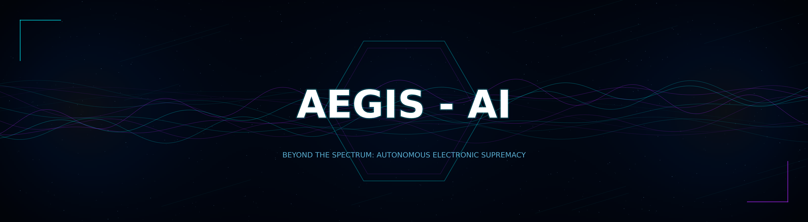
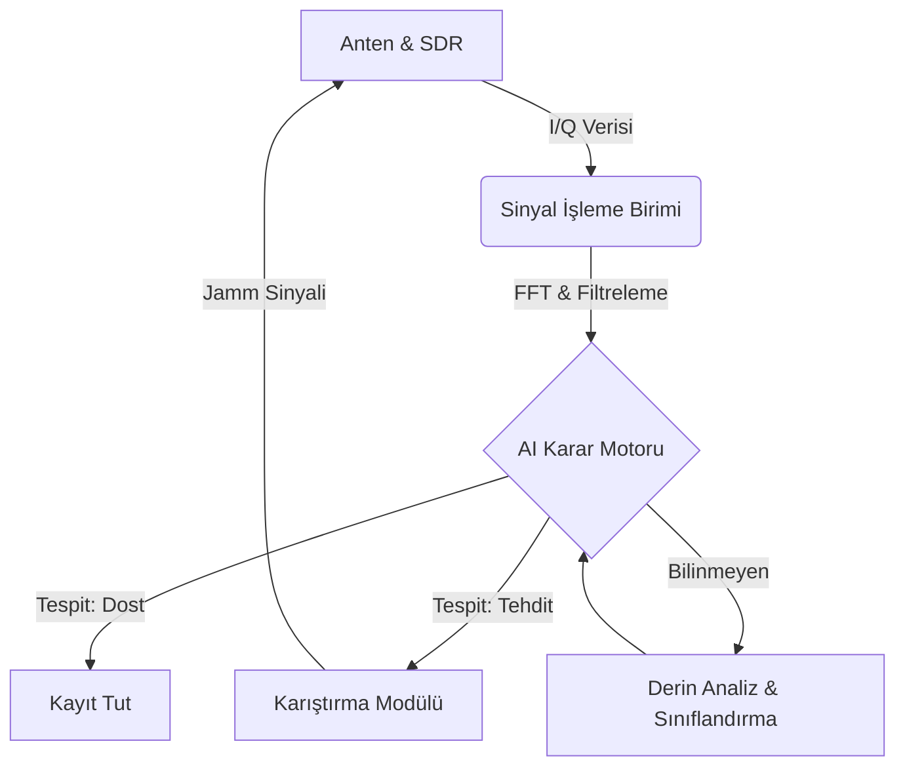

<div align="center">



# 🛰️ Aegis-AI
### Otonom Sinyal İstihbaratı ve Elektronik Taarruz Paketi

[](https://opensource.org/licenses/MIT)
[](https://www.python.org/downloads/)
[]()
[]()

*“Geleceğin savaşlarında spektruma hakim olan, sahaya hakim olur.”*

[Belgeler](docs/) | [Yol Haritası](#-yol-haritası-2026-takvimi) | [İletişim](#-geliştirici-hakkında)

</div>

---

## ⚡ Proje Vizyonu

Aegis-AI, günümüzün karmaşık elektromanyetik spektrumunda operatör üzerindeki yükü azaltmak için otonom çalışma yöntemleri sunan yeni nesil bir **Elektronik Harp (EH)** çözümüdür. 

Bu proje, Türkiye'nin savunma sanayindeki yerli teknoloji hamlesine katkı sunmak amacıyla; sinyal analizlerini yapay zeka ile hızlandıran ve taarruz görevlerini otonomize eden bir mimariyle geliştirilmiştir.

## 🏗️ Sistem Mimarisi



## 🛡️ Modüller ve Yetenekler

| Modül | Özellik | Açıklama |
| :--- | :--- | :--- |
| **🔍 Elektronik Destek (ED)** | **Sinyal Tespiti** | Gürültü tabanını aşan yayınların anlık tespiti. |
| | **Parametre Çıkarımı** | PRI, PW ve Doluluk Oranı (Duty Cycle) otomatik tespiti. |
| | **Yön Bulma (DF)** | 4-antenli genlik karşılaştırma yöntemi ile DoA kestirimi. |
| | **AI Sınıflandırma** | Derin öğrenme tabanlı modülasyon ve tehdit tipi tahmini. |
| **⚔️ Elektronik Taarruz (ET)** | **Akıllı Karıştırma** | Tehdit aktifken devreye giren "Look-through" jamming. |
| | **Aldatma (Spoofing)** | Yanıltıcı menzil/hız pulsesi üretimi (False Targets). |
| | **FH Takip/Karıştırma** | Frekans atlamalı (Hopping) sinyalleri takip ve noktasal karıştırma. |

## 📖 Operasyonel Senaryolar

Aegis-AI, farklı harekat ortamlarında otonom çözümler sunar:

### 🚁 Senaryo A: İHA Sürüsü Tespiti
Geniş bantlı spektrum taraması ile sürünün kullandığı frekans atlamalı (FHSS) haberleşme linklerini saniyeler içinde tespit eder. AI modülü, sinyalleri "Sürü Haberleşmesi" olarak etiketler ve `FrequencyHoppingJammer` modülünü devreye alarak sürü koordinasyonunu bozar.

### ⚓ Senaryo B: Deniz Platformu Öz-Savunma
Yaklaşan bir füze arayıcı başlığına (Seeker) ait X-Bant radar emisyonlarını tespit eden sistem, anında **RGPO (Range Gate Pull Off)** aldatma algoritmasını (`SpoofingJammer`) tetikleyerek füzeyi hayali bir hedefe yönlendirir.

## 🔬 Teknik Derin Bakış ve Matematiksel Temeller

### 🧮 Spektral Analiz (FFT)
Sistemin kalbinde yer alan FFT motoru, zaman domainindeki $s(t)$ sinyalini frekans domainine $S(f)$ taşır:
$$S(f) = \int_{-\infty}^{\infty} s(t) e^{-i 2\pi ft} dt$$
Burada elde edilen büyüklük spektrumu üzerinden **Gürültü Tabanı (Noise Floor)** kestirimi yapılır ve dinamik eşikleme ile sinyal tespiti gerçekleştirilir.

### 📉 Parametre Kestirimi (PRI & PW)
Darbe tekrarlama aralığı (PRI), yükselen kenarlar arasındaki zaman farkı ile hesaplanır:
$$PRI = t_{rise}(n) - t_{rise}(n-1)$$
AI motoru, bu parametreleri kullanarak radarın çalışma modunu (Tarama, Takip, Kilit) belirler.

## 🧠 AI & Otonom Karar Destek (ADSS)

Aegis-AI, sadece bir sinyal işleyici değil, aynı zamanda otonom bir operatördür.
- **Tehdit Kütüphanesi:** Radar ve komünikasyon sinyallerine ait karakteristik imzaları içeren veritabanı.
- **Otonom Strateji Belirleme:** Tespit edilen sinyalin tipine göre (LPI Radar, FC Radar, Link-16 vb.) en etkili EH tekniğini (Gürültü, Aldatma veya Akıllı Karıştırma) milisaniyeler içinde seçer.

## 📊 Dashboard (Gerçek Zamanlı Gösterge Paneli)

Modern ve futuristik EH arayüzü sayesinde tüm spektrum operasyonel olarak takip edilebilir:
- **Spektrum Analizörü:** Anlık FFT görselleştirme.
- **Tehdit Göstergesi:** Tespit edilen tehditlerin güven skoru ve tipi.
- **Pusula Görünümü:** Yön bulma sonuçlarının görsel gösterimi.
- **Sistem Durumu:** Aktif karıştırma stratejisi ve güç çıkış takibi.

## � Proje Manifestosu

> "Görünmeyeni gör, bilinmeyeni etkisiz hale getir."

Aegis-AI, elektromanyetik spektrumun bir savaş alanı değil, bir bilgi alanı olduğuna inanır. Amacımız, en karmaşık sinyal ortamlarında bile operatöre netlik kazandırmak ve otonom sistemlerle savunma kabiliyetini maksimize etmektir. Bu proje, sadece bir kod yığını değil; bir mühendisin spektrum üzerindeki egemenlik iddiasıdır.

## 📂 Depo Yapısı

```text
├── src/
│   ├── signal_processing/  # FFT, Parametre Çıkarımı ve DoA algoritmaları
│   ├── ai_engine/          # Sınıflandırma, Tehdit Kütüphanesi ve Autonomy Manager
│   ├── jamming_logic/      # ET (Gürültü, Aldatma, FH) algoritmaları
│   ├── dashboard/          # Flask tabanlı görsel arayüz
│   └── verify_eh.py        # Sistem doğrulama scripti
├── docs/
│   ├── Teknik_Yeterlilik/  # TYF dokümantasyonu (EH_Sartname_Checklist.md)
│   └── Kritik_Tasarim/     # KTR detayları
├── assets/                 # Görsel materyaller (Banner, Logolar)
└── README.md
```

## 🚀 Hızlı Başlangıç

Sistemi test etmek ve arayüzü görmek için aşağıdaki adımları izleyin:

```bash
# 1. Gerekli kütüphaneleri yükleyin
pip install -r requirements.txt

# 2. Sistem yeteneklerini doğrulayın (ED/ET/AI)
python src/verify_eh.py

# 3. Dashboard'u başlatın
python src/dashboard/app.py
```
*Ardından tarayıcınızdan `http://127.0.0.1:5000` adresine giderek arayüzü inceleyebilirsiniz.*

## 📅 Yol Haritası (2026 Takvimi)

- [x] **Temel ED/ET Altyapısı:** Tamamlandı
- [x] **AI Otonomi ve Karar Destek:** Tamamlandı
- [x] **Görsel EH Dashboard:** Tamamlandı
- [ ] **Teknik Yeterlilik Formu:** 24.03.2026
- [ ] **Kritik Tasarım Raporu:** 30.04.2026
- [ ] **Sistem Tanımlama Videosu:** 14.07.2026
- [ ] **TEKNOFEST Finali:** Eylül 2026

## 👤 Geliştirici Hakkında

Ağustos 2023'te yazılım serüvenine başlamış, disiplinler arası çalışmayı (Software + AI + Electronics) benimsemiş bağımsız bir geliştiriciyim. Aegis-AI, tek kişilik bir Ar-Ge merkezinin (**Dev-in-Scrubs**) ürünüdür.

---

<div align="center">
    <i>Bu proje, TEKNOFEST 2026 Elektronik Harp Yarışması Şartnamesi kriterlerine göre geliştirilmektedir.</i>
</div>
