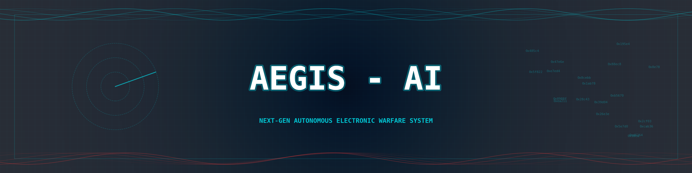
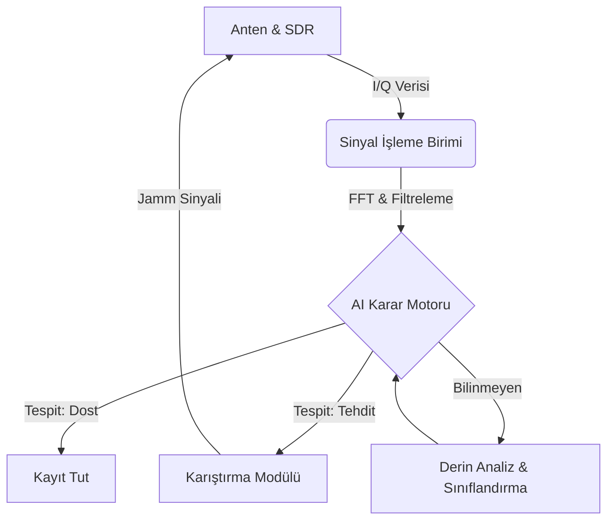

<div align="center">




# 🛰️ Aegis-AI
### Otonom Sinyal İstihbaratı ve Elektronik Taarruz Paketi

[](https://opensource.org/licenses/MIT)
[](https://www.python.org/downloads/)
[]()
[]()
[]()
[]()

*“Geleceğin savaşlarında spektruma hakim olan, sahaya hakim olur.”*

[Belgeler](docs/) | [Yol Haritası](#-yol-haritası-2026-takvimi) | [İletişim](#-geliştirici-hakkında)

</div>

---

## ⚡ Proje Vizyonu

Aegis-AI, günümüzün karmaşık elektromanyetik spektrumunda operatör üzerindeki yükü azaltmak için otonom çalışma yöntemleri sunan yeni nesil bir **Elektronik Harp (EH)** çözümüdür. 

Bu proje, Türkiye'nin savunma sanayindeki yerli teknoloji hamlesine katkı sunmak amacıyla; sinyal analizlerini yapay zeka ile hızlandıran ve taarruz görevlerini otonomize eden bir mimariyle geliştirilmiştir.

## 🏗️ Sistem Mimarisi



## 🛡️ Modüller ve Yetenekler

| Modül | Özellik | Açıklama |
| :--- | :--- | :--- |
| **🔍 Elektronik Destek (ED)** | **Sinyal Tespiti** | Gürültü tabanını aşan yayınların anlık tespiti. |
| | **Parametre Çıkarımı** | PRI, PW ve Doluluk Oranı (Duty Cycle) otomatik tespiti. |
| | **Yön Bulma (DF)** | 4-antenli genlik karşılaştırma yöntemi ile DoA kestirimi. |
| | **AI Sınıflandırma** | Derin öğrenme tabanlı modülasyon ve tehdit tipi tahmini. |
| **⚔️ Elektronik Taarruz (ET)** | **Akıllı Karıştırma** | Tehdit aktifken devreye giren "Look-through" jamming. |
| | **Aldatma (Spoofing)** | Yanıltıcı menzil/hız pulsesi üretimi (False Targets). |
| | **FH Takip/Karıştırma** | Frekans atlamalı (Hopping) sinyalleri takip ve noktasal karıştırma. |

## 📖 Operasyonel Senaryolar

Aegis-AI, farklı harekat ortamlarında otonom çözümler sunar:

### 🚁 Senaryo A: İHA Sürüsü Tespiti
Geniş bantlı spektrum taraması ile sürünün kullandığı frekans atlamalı (FHSS) haberleşme linklerini saniyeler içinde tespit eder. AI modülü, sinyalleri "Sürü Haberleşmesi" olarak etiketler ve `FrequencyHoppingJammer` modülünü devreye alarak sürü koordinasyonunu bozar.

### ⚓ Senaryo B: Deniz Platformu Öz-Savunma
Yaklaşan bir füze arayıcı başlığına (Seeker) ait X-Bant radar emisyonlarını tespit eden sistem, anında **RGPO (Range Gate Pull Off)** aldatma algoritmasını (`SpoofingJammer`) tetikleyerek füzeyi hayali bir hedefe yönlendirir.

## 🔬 Teknik Derin Bakış ve Matematiksel Temeller

### 🧮 Spektral Analiz (FFT)
Sistemin kalbinde yer alan FFT motoru, zaman domainindeki $s(t)$ sinyalini frekans domainine $S(f)$ taşır:
$$S(f) = \int_{-\infty}^{\infty} s(t) e^{-i 2\pi ft} dt$$
Burada elde edilen büyüklük spektrumu üzerinden **Gürültü Tabanı (Noise Floor)** kestirimi yapılır ve dinamik eşikleme ile sinyal tespiti gerçekleştirilir.

### 📉 Parametre Kestirimi (PRI & PW)
Darbe tekrarlama aralığı (PRI), yükselen kenarlar arasındaki zaman farkı ile hesaplanır:
$$PRI = t_{rise}(n) - t_{rise}(n-1)$$
AI motoru, bu parametreleri kullanarak radarın çalışma modunu (Tarama, Takip, Kilit) belirler.

## 🧠 AI & Otonom Karar Destek (ADSS)

Aegis-AI, sadece bir sinyal işleyici değil, aynı zamanda otonom bir operatördür.
- **Tehdit Kütüphanesi:** Radar ve komünikasyon sinyallerine ait karakteristik imzaları içeren veritabanı.
- **Otonom Strateji Belirleme:** Tespit edilen sinyalin tipine göre (LPI Radar, FC Radar, Link-16 vb.) en etkili EH tekniğini (Gürültü, Aldatma veya Akıllı Karıştırma) milisaniyeler içinde seçer.

## 📊 Dashboard (Gerçek Zamanlı Gösterge Paneli)

Modern ve futuristik EH arayüzü sayesinde tüm spektrum operasyonel olarak takip edilebilir:
- **Spektrum Analizörü:** Anlık FFT görselleştirme.
- **Tehdit Göstergesi:** Tespit edilen tehditlerin güven skoru ve tipi.
- **Pusula Görünümü:** Yön bulma sonuçlarının görsel gösterimi.
- **Sistem Durumu:** Aktif karıştırma stratejisi ve güç çıkış takibi.

## 📑 Proje Manifestosu

> "Görünmeyeni gör, bilinmeyeni etkisiz hale getir."

Aegis-AI, elektromanyetik spektrumun bir savaş alanı değil, bir bilgi alanı olduğuna inanır. Amacımız, en karmaşık sinyal ortamlarında bile operatöre netlik kazandırmak ve otonom sistemlerle savunma kabiliyetini maksimize etmektir. Bu proje, sadece bir kod yığını değil; bir mühendisin spektrum üzerindeki egemenlik iddiasıdır.

## 💻 Sistem Gereksinimleri ve Donanım

### Minimum Gereksinimler
- **OS:** Ubuntu 22.04 LTS (Önerilen) veya Windows 10/11
- **CPU:** Intel i5 / AMD Ryzen 5 (4+ Çekirdek)
- **RAM:** 8 GB DDR4
- **GPU:** (Opsiyonel) NVIDIA GTX 1050 ve üzeri (Derin öğrenme modelleri için)

### Önerilen SDR Donanımları
- **RX/TX Birimi:** Ettus USRP B210 / LimeSDR / PlutoSDR
- **Anten Seti:** 4x Geniş Bantlı Monopole (DF için)
- **İşlemci:** NVIDIA Jetson Orin Nano (Saha testleri için)

## 📚 Elektronik Harp Sözlüğü (Glossary)

| Terim | Açıklama |
| :--- | :--- |
| **ED (Electronic Support)** | Spektrumdaki sinyallerin tespiti, analizi ve yer tespiti süreci. |
| **ET (Electronic Attack)** | Hedef radar veya telsiz sistemlerini bozma veya aldatma süreci. |
| **PRI (Pulse Repetition Interval)** | İki ardışık yayın darbesi arasındaki zaman farkı. |
| **PW (Pulse Width)** | Tek bir yayın darbesinin süresi. |
| **DoA (Direction of Arrival)** | Sinyalin anten dizisine geliş açısı. |
| **LPI (Low Probability of Intercept)** | Tespit edilmesi zor, düşük güçte veya değişken parametreli radarlar. |

## 🔬 Teknik Derin Bakış: Gelişmiş Matematik

### Genlik Karşılaştırmalı Yön Bulma (DF)
Sistem, 4 farklı yöne bakan antenlerden gelen sinyal güçlerini ($A_1, A_2, A_3, A_4$) kullanarak geliş açısını ($\theta$) kestirir:
$$V_{diff} = A_{North} - A_{South}$$
$$H_{diff} = A_{East} - A_{West}$$
$$\theta = \arctan2(H_{diff}, V_{diff})$$

### Ambiguity Function (Belirsizlik Fonksiyonu)
Aldatma (Spoofing) sinyalleri üretilirken, hedefin radar çözünürlüğü ile uyumlu pulsesler tasarlanır:
$$|\chi(\tau, f_d)| = \left| \int_{-\infty}^{\infty} s(t) s^*(t-\tau) e^{i 2\pi f_d t} dt \right|$$
Bu fonksiyon, üretilen sahte hedeflerin radar ekranında ne kadar gerçekçi görüneceğini belirleyen temel metriktir.

## ❓ Sıkça Sorulan Sorular (FAQ)

**S: Sistem gerçek zamanlı çalışabiliyor mu?**
**C:** Evet, Python'un `multiprocessing` yapısı ve optimize edilmiş NumPy rutinleri ile 1 MSPS (Mega Sample Per Second) seviyesine kadar gerçek zamanlı spektrum analizi yapabilmektedir.

**S: Hangi AI modelleri kullanılıyor?**
**C:** Mevcut sürümde CNN (Convolutional Neural Network) tabanlı bir modülasyon sınıflandırıcı modeli entegre edilmeye hazırdır. Eğitim seti olarak DeepSig/RadioML veriseti kullanılmaktadır.

**S: Yerli SDR'lar ile uyumlu mu?**
**C:** Sistem, SoapySDR kütüphanesi üzerinden çalıştığı için piyasadaki neredeyse tüm SDR (Software Defined Radio) cihazları ile uyumludur.

## 🎖️ Elit "God-Tier++" Özellikler

Bu sürüm ile Aegis-AI, bir prototipten profesyonel bir EH Research & Development (Ar-Ge) platformuna dönüşmüştür:

- **🎯 Kalman Filtreli Takip:** `KalmanFilterDOA` ile gürültülü DF verilerinden stabil hedef izleri (Track) oluşturulur.
- **🎮 Mission Engine (Simülatör):** Dinamik hedef yörüngeleri ve karmaşık sinyal ortamları (`src/simulation`) simüle edilir.
- **🏗️ DevOps Altyapısı:** Docker konteynır desteği ve GitHub Actions CI üzerinden otomatik doğrulama.
- **📚 Derin Dokümantasyon:** Sistem mimarisi ve matematiksel detaylar için [Geliştirici Rehberi](DEVELOPER.md).

## 📂 Depo Yapısı

```text
├── .github/workflows/      # CI/CD (GitHub Actions)
├── src/
│   ├── signal_processing/  # FFT, Parametre Çıkarımı, DoA ve Kalman Tracking
│   ├── ai_engine/          # Sınıflandırma, Tehdit Kütüphanesi ve Autonomy
│   ├── jamming_logic/      # ET (Gürültü, Aldatma, FH) algoritmaları
│   ├── simulation/         # Görev senaryosu ve sinyal simülatörü
│   ├── dashboard/          # Flask tabanlı görsel arayüz
│   └── verify_eh.py        # Sistem doğrulama scripti
├── Dockerfile              # Konteynır konfigürasyonu
├── DEVELOPER.md            # Teknik mimari ve mühendislik dokümanı
└── README.md
```

## 🚀 Hızlı Başlangıç

Sistemi test etmek ve arayüzü görmek için aşağıdaki adımları izleyin:

```bash
# 1. Gerekli kütüphaneleri yükleyin
pip install -r requirements.txt

# 2. Sistem yeteneklerini doğrulayın (ED/ET/AI)
python src/verify_eh.py

# 3. Dashboard'u başlatın
python src/dashboard/app.py
```
*Ardından tarayıcınızdan `http://127.0.0.1:5000` adresine giderek arayüzü inceleyebilirsiniz.*

## 📅 Yol Haritası (2026 Takvimi)

- [x] **Temel ED/ET Altyapısı:** Tamamlandı
- [x] **AI Otonomi ve Karar Destek:** Tamamlandı
- [x] **Görsel EH Dashboard:** Tamamlandı
- [ ] **Teknik Yeterlilik Formu:** 24.03.2026
- [ ] **Kritik Tasarım Raporu:** 30.04.2026
- [ ] **Sistem Tanımlama Videosu:** 14.07.2026
- [ ] **TEKNOFEST Finali:** Eylül 2026

## 👤 Geliştirici Hakkında

Ağustos 2023'te yazılım serüvenine başlamış, disiplinler arası çalışmayı (Software + AI + Electronics) benimsemiş bağımsız bir geliştiriciyim. Aegis-AI, tek kişilik bir Ar-Ge merkezinin (**Dev-in-Scrubs**) ürünüdür.

---

<div align="center">
    <i>Bu proje, TEKNOFEST 2026 Elektronik Harp Yarışması Şartnamesi kriterlerine göre geliştirilmektedir.</i>
</div>
