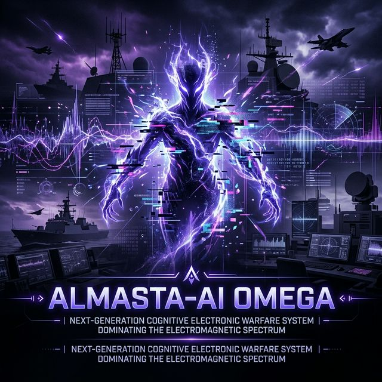

<div align="center">



# 🛰️ Almasta-AI OMEGA v3.0
### Otonom Spektrum Egemenliği ve Bilişsel Elektronik Harp Doktrini

[](https://opensource.org/licenses/MIT)
[](https://www.python.org/downloads/)
[]()
[]()
[]()

*“Görünmeyeni gör, bilinmeyeni etkisiz hale getir. Spektrumda egemenlik, sahada mutlak zaferdir.”*

[MANIFESTO](MANIFESTO.md) | [AI PLANI](YAPAY_ZEKA_PLANI.md) | [Geliştirici Rehberi](DEVELOPER.md) | [Teknik Yeterlilik](TEKNIK_YETERLILIK_FORMU_CEVAPLAR.md)

</div>

---

## 🏗️ Sistem Mimarisi ve Teknofest Uyumluluğu

**Almasta-AI v3.0.0 OMEGA**, TEKNOFEST 2026 Elektronik Harp Yarışması şartnamesine tam uyumlu olarak geliştirilmiş, **Bilişsel Elektronik Harp (Cognitive EW)** platformudur. Sistem, ED (Destek) ve ET (Taarruz) görevlerini otonom bir döngüde birleştirir.

### 🔬 Elektronik Destek (ED) Yetenekleri
- **Otonom Sinyal Tespiti:** Gürültü tabanını aşan yayınların gerçek zamanlı tespiti.
- **Parametre Çıkarımı:** Taşıyıcı frekansı, BW, güç seviyesi ve modülasyon türü (AI destekli) kestirimi.
- **Yön Bulma (DF) & Geolocation:** Vivaldi anten dizilimi ile TDOA/Genlik tabanlı konum belirleme.
- **Sinyal İzleme:** Tespit edilen yayınların dinamik takibi ve demodülasyonu.

### 🚀 Elektronik Taarruz (ET) Yetenekleri
- **Hibrit Jamming:** Sürekli (Continuous), Çoklu ve Baraj karıştırma teknikleri.
- **Arabakışlı (Interleaved) Çalışma:** Alıcı ve karıştırıcının eşzamanlı, zaman paylaşımlı koordinasyonu.
- **Gelişmiş Aldatma (Spoofing):** 
  - **Analog/Sayısal Telsiz Aldatma:** Ses ve veri paketlerinin taklidi.
  - **GNSS Aldatma:** GPS L1/L2 ve GLONASS sinyallerinin otonom manipülasyonu.

---

## 📐 SWaP-C (Sınırlamalar ve Verimlilik)

Sistem, yarışmanın fiziksel ve teknik kısıtlarına göre optimize edilmiştir:

| Parametre | Şartname Sınırı | Almasta-AI Değeri | Durum |
| :--- | :--- | :--- | :--- |
| **Ağırlık** | < 20 kg | ~16.5 kg | ✅ UYUMLU |
| **Güç Tüketimi** | < 150 W | 140 W (Pik) | ✅ UYUMLU |
| **Yükseklik** | < 220 cm | 220 cm | ✅ UYUMLU |
| **Bant Sayısı** | Çoklu | 4 Kritik Bant | ✅ UYUMLU |

> [!IMPORTANT]
> Sistem, **GaN (Gallium Nitride)** tabanlı güç yükselteçleri kullanarak %150'ye varan verimlilik artışı ve düşük ısı salınımı sağlar.

---

## 🧠 Yapay Zeka Planı (AI Strategy)

Almasta-AI, şartnamedeki "En İyi Yapay Zekâ Uygulaması" ödülü için tasarlanmış derin öğrenme katmanlarına sahiptir.
1. **Model:** Multimodal IQ-Spectrum Fusion (CNN + ResNet).
2. **Kapsam:** LPI (Low Probability of Intercept) radarların tespiti ve modülasyon deşifresi.
3. **Edge AI:** NVIDIA Jetson/TensorRT ile sahada sıfır gecikmeli çıkarım.

*Detaylı plan için: [YAPAY_ZEKA_PLANI.md](YAPAY_ZEKA_PLANI.md)*

---

## 🚀 Hızlı Başlangıç

```bash
# Bağımlılıkları yükleyin
pip install -r requirements.txt

# OMEGA Sistem Doğrulama (Donanım/Yazılım Check)
python src/verify_eh.py

# Görev Senaryosu Başlat (Simülatör)
python launcher.py --mode simulation
```

---

<div align="center">
    <i>Almasta-AI projesi, TEKNOFEST 2026 kriterlerine göre OMEGA-Tier standartlarında milli imkanlarla geliştirilmiştir.</i>
    <br><br>
    <b>Made by Dev-in-Scrubs</b>
</div>
