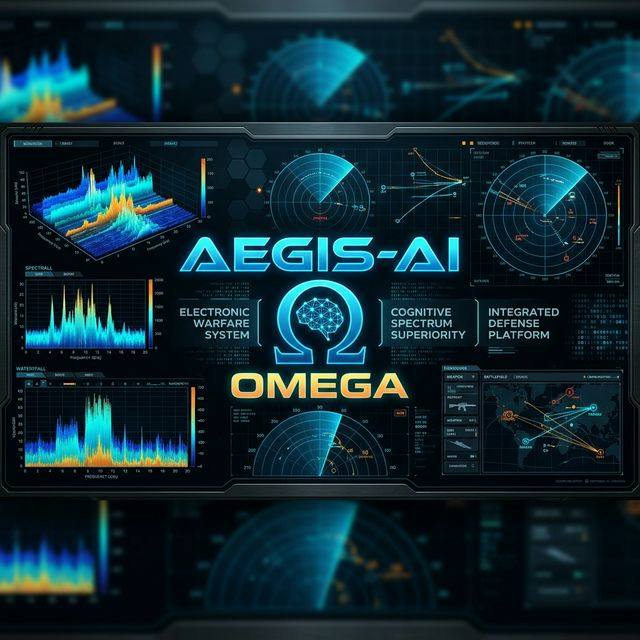
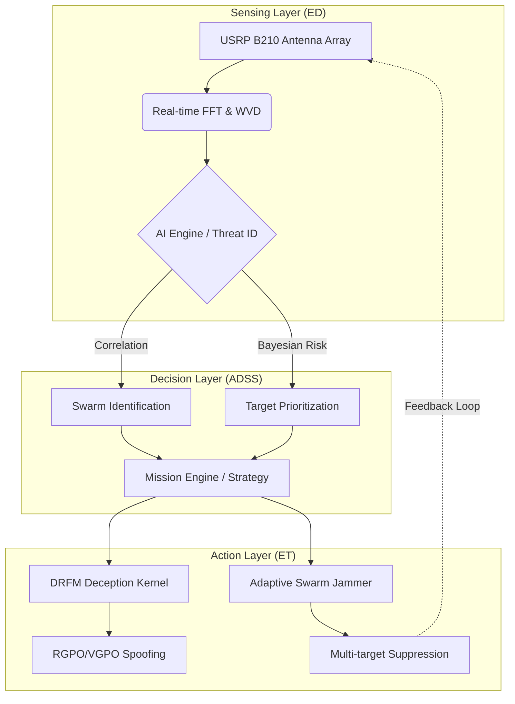

<div align="center">



# 🛰️ Aegis-AI OMEGA v3.0
### Otonom Spektrum Egemenliği ve Bilişsel Elektronik Harp Doktrini

[](https://opensource.org/licenses/MIT)
[](https://www.python.org/downloads/)
[]()
[]()
[]()
[]()

*“Görünmeyeni gör, bilinmeyeni etkisiz hale getir. Spektrumda egemenlik, sahada mutlak zaferdir.”*

[MANIFESTO](MANIFESTO.md) | [Geliştirici Rehberi](DEVELOPER.md) | [Teknik Yeterlilik](TEKNIK_YETERLILIK_FORMU_CEVAPLAR.md) | [Yol Haritası](#-yol-haritası-2026-takvimi)

</div>

---

## 🏛️ Proje Vizyonu: OMEGA Sürümü

**Aegis-AI v3.0.0 OMEGA**, TEKNOFEST 2026 Elektronik Harp Yarışması için geliştirilen, geleneksel ED/ET sistemlerinin ötesine geçen bir **Bilişsel Elektronik Harp (Cognitive EW)** platformudur. OMEGA sürümü ile sistemimiz, statik karşı önlemlerden dinamik, aldatma odaklı ve otonom sürü bastırma yeteneklerine evrilmiştir.

## 🏗️ Sistem Mimarisi

Sistem, **Kapalı Çevrim (Closed-Loop)** bir otonomi döngüsü üzerine inşa edilmiştir.


```mermaid
graph TD
    subgraph "Sensing Layer (ED)"
        A[USRP B210 Antenna Array] --> B(Real-time FFT & WVD)
        B --> C{AI Engine / Threat ID}
    end
    
    subgraph "Decision Layer (ADSS)"
        C -->|Correlation| D[Swarm Identification]
        C -->|Bayesian Risk| E[Target Prioritization]
        D & E --> F[Mission Engine / Strategy]
    end
    
    subgraph "Action Layer (ET)"
        F --> G[DRFM Deception Kernel]
        F --> H[Adaptive Swarm Jammer]
        G --> I[RGPO/VGPO Spoofing]
        H --> J[Multi-target Suppression]
    end
    
    J -.->|Feedback Loop| A
```

## 🧠 "OMEGA-Tier" Yetenekler

### 🛡️ 1. DRFM (Digital Radio Frequency Memory) Deception
Sistem, düşman radar emisyonlarını sızdırarak kopyalar ve otonom olarak manipüle eder.
- **RGPO (Range Gate Pull Off):** Sahte menzil yankıları ile radarı gerçek hedeften uzaklaştırır.
- **VGPO (Velocity Gate Pull Off):** Sahte Doppler kayması ile füze arayıcı başlıklarını şaşırtır.

### 🚁 2. Sürü Bastırma (Swarm Suppression)
**Multi-Emitter Correlation** algoritması ile sahada birden fazla (Swarm) İHA'nın koordinasyon frekanslarını tespit eder ve senkronize olarak sürü linklerini koparır.

### 🔬 3. LPI Radar Deşifre (WVD & Entropy)
Geleneksel ESM sistemlerinin kaçırdığı Düşük Tespit Edilme (LPI) radarlarını, **Wigner-Ville Distribution** ve **Spectral Entropy** motorları ile tespit eder.

## 🧮 Teknik Derin Bakış: OMEGA Matematiği

### Spektral Entropi (Detection Metric)
Sinyal yapısını pure noise'dan ayırt etmek için normalized Shannon entropy ($H$) kullanılır:
$$H(S) = - \frac{\sum P(f_i) \log P(f_i)}{\log N}$$
Düşük entropi değerli bölgeler, otonom olarak "Structured Threat" olarak etiketlenir.

### DRFM Koherent Aldatma
Yakalatan $s(t)$ sinyali, $\tau(t)$ gecikmesi ve $f_d(t)$ Doppler kayması ile yeniden üretilir:
$$s_{jam}(t) = \text{env}(t) \cdot A \cdot s(t - \tau(t)) \cdot e^{j 2\pi f_d(t) t}$$

---

## 📂 Depo Yapısı

```text
├── src/
│   ├── signal_processing/  # FFT, WVD, DRFM Kernel, Tracking
│   ├── ai_engine/          # Bayesian Risk, Swarm Correlation
│   ├── jamming_logic/      # ET (Noise, DRFM, Swarm, GNSS)
│   ├── simulation/         # Swarm & Cognitive Scenarios
│   ├── dashboard/          # High-Density CLI UI (Rich)
│   └── verify_eh.py        # System Integrity Check
├── MANIFESTO.md            # Elektronik Harp Doktrini
├── DEVELOPER.md            # Teknik Derin Bakış
└── README.md
```

## 🚀 Hızlı Başlangıç

```bash
# Bağımlılıkları yükleyin
pip install -r requirements.txt

# OMEGA Sistem Doğrulama (Renkli CLI)
python src/verify_eh.py

# Görev Senaryosu Başlat (Simülatör Dashboard)
python launcher.py --mode simulation
```

## 📅 Yol Haritası (2026 Takvimi)

- [x] **v1.0 - Core Foundation:** Temel DSP ve FFT logic.
- [x] **v2.0 - Autonomy:** Otonom karar destek (ADSS).
- [x] **v3.0 - OMEGA:** DRFM, Swarm Suppression ve LPI Entropy.
- [ ] **v4.0 - Field Test:** Gerçek USRP B210 saha testleri.

---

<div align="center">
    <i>Bu proje, TEKNOFEST 2026 Elektronik Harp Yarışması kriterlerine tam uyumlu olarak OMEGA-Tier standartlarında geliştirilmiştir.</i>
    <br><br>
    <b>Made by Dev-in-Scrubs</b>
</div>
