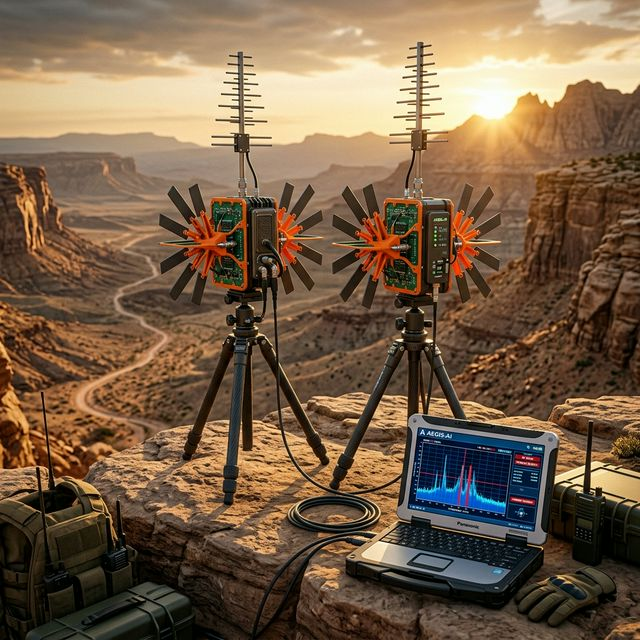
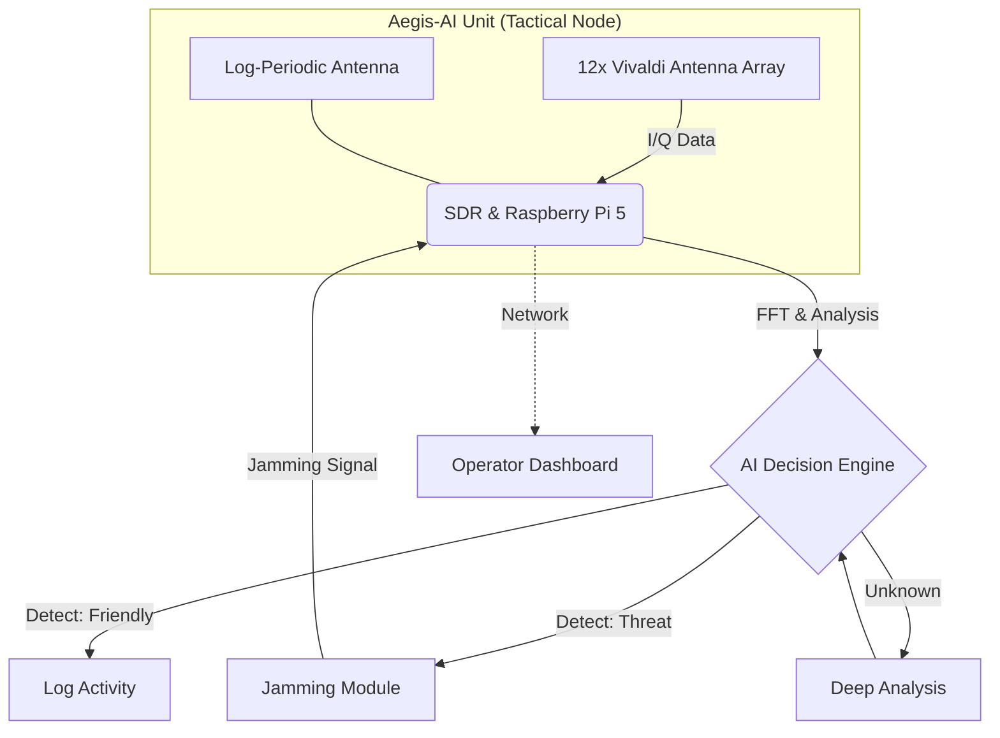

<div align="center">



# 🛰️ Aegis-AI
### Otonom Sinyal İstihbaratı ve Elektronik Taarruz Paketi

[](https://opensource.org/licenses/MIT)
[](https://www.python.org/downloads/)
[]()
[]()
[]()
[]()
[]()

*“Geleceğin savaşlarında spektruma hakim olan, sahaya hakim olur.”*

[Belgeler](docs/) | [Şartname Özeti](YARISMA_SARTNAMESI_DETAYLARI.md) | [Yol Haritası](#-yol-haritası-2026-takvimi) | [İletişim](#-geliştirici-hakkında)

</div>


---

## 📄 Teknik Rapor & Proje Örnekleri (Referans Kütüphanesi)

Aegis-AI geliştirilirken, benzer küresel yarışmalarda derece almış takımların teknik raporları ve mimari tasarım dökümanları incelenmiştir. İşte faydalı 10 teknik rapor ve write-up örneği:

1.  **DARPA SC:** [Takım Tasarım Raporu ve Teknik Mimari (DTIC-ADA610741)](https://apps.dtic.mil/sti/pdfs/ADA610741.pdf) – Spektrum paylaşımı ve otonom karar motoru.
2.  **DARPA SC2:** [GatorWings Dinamik Spektrum Paylaşım Tasarımı (IEEE)](https://ieeexplore.ieee.org/document/9048613) – Yarışma birincisinin teknik çözüm detayları.
3.  **Hack-a-Sat 2:** [Finalist Takımların Teknik Raporları (Toplu PDF)](https://github.com/cromulencellc/hackasat-final-2021/blob/main/HAS2%20Finalist%20Technical%20Papers%20Distro%20A.pdf) – Uydu EH ve siber güvenlik mimarileri.
4.  **Hack-a-Sat:** [Moonlighter: Uzayda Hacking Sandbox Teknik Sunumu](https://ieeexplore.ieee.org/document/10521234) – Yörüngedeki EH test yatağı altyapısı.
5.  **MIT RF Challenge (ICASSP'24):** [Sinyal Ayrıştırma Yarışması Değerlendirme Raporu (IEEE)](https://ieeexplore.ieee.org/document/10447334) – Sinyal ayrıştırma için derin öğrenme metodları.
6.  **MIT RF Research:** [RF Sınıflandırma için Derin Öğrenme Metodolojisi (ArXiv 2303.11183)](https://arxiv.org/abs/2303.11183) – Otonom ED sinyal işleme temelleri.
7.  **AFRL SDR Challenge:** [Gelişmiş SDR Sistemleri ve Proje Gereksinimleri Portalı](https://wbi-innovates.zohobackstage.com/afrlsdr) – AFRL/WBI resmi teknik dokümantasyon kanalı.
8.  **DEF CON 30 RF Village:** [RF SIGINT ve Karıştırma Teknikleri Sunum Arşivi](https://rfhackers.com/ctf) – Pratik CTF write-up ve EH teknikleri.
9.  **TEKNOFEST KTR:** [Elektronik Harp Kritik Tasarım Raporu Örnek Projesi (GitHub)](https://github.com/TurgayYener/Teknofest-Elektronik-Harp-KTR) – Gerçek bir KTR raporu ve algoritma yapısı referansı.
10. **SDR Forum:** [Smart Radio Challenge Bilişsel Radyo & EH Arşivi](http://www.radiochallenge.org/) – Tarihsel kognitif radyo tasarım raporları.

## 🔗 Benzer Küresel Yarışmalar & Referanslar

Aegis-AI, dünya çapındaki prestijli Elektronik Harp ve RF sinyal işleme yarışmalarındaki teknik standartlar ve kurgular referans alınarak geliştirilmiştir:

### 🇺🇸 AFRL SDR University Challenge (Air Force Research Lab)
- [Official Portal: AFRL/WBI SDR Challenge](https://wbi-innovates.zohobackstage.com/afrlsdr)
- [Technical Kit Details (USRP B210)](https://wbi-innovates.zohobackstage.com/afrlsdr)
- [MathWorks SDR Challenge Mentorship](https://www.mathworks.com/academia/student-challenges/afrl-sdr-university-challenge.html)
- [AFRL University Challenge Achievements](https://wbi-innovates.zohobackstage.com/afrlsdr)
- [News: Beyond 5G SDR Security](https://www.af.mil/News/Article-Display/Article/2374665/afrl-leads-beyond-5g-university-challenge/)

### 🚀 DARPA Spectrum Collaboration Challenge (SC2)
- [Official Program Page](https://www.darpa.mil/program/spectrum-collaboration-challenge)
- [DARPA SC2 Championship News](https://www.darpa.mil/news-events/2019-10-23)
- [The Colosseum: Massive RF Channel Emulator](https://www.darpa.mil/news-events/2019-10-23)
- [DARPA Spectrum Challenge Results (PDF)](https://apps.dtic.mil/sti/pdfs/ADA610741.pdf)
- [GatorWings: Winning $2M Strategy (IEEE)](https://ieeexplore.ieee.org/document/9048613)

### 🛰️ Hack-a-Sat (Space Force / AFRL)
- [Official Portal: hackasat.com](https://hackasat.com/)
- [Moonlighter Mission Overview](https://hackasat.com/moonlighter/)
- [Hack-a-Sat Technical Library (GitHub)](https://github.com/cromulence/hackasat)
- [Polish Team Poland Can Into Space Writeup](https:// PolandCanIntoSpace.github.io)
- [mHACKeroni Winning Experience Writeup](https://mhackeroni.it/)

### 🧠 MIT RF Signal Separation Challenge
- [Official Hub: rfchallenge.mit.edu](https://rfchallenge.mit.edu/)
- [Leaderboard & Performance Metrics](https://rfchallenge.mit.edu/leaderboard/)
- [ICASSP 2024 Challenge Documentation](https://rfchallenge.mit.edu/icassp24-challenge/)
- [RF Dataset & Technical Standards](https://rfchallenge.mit.edu/dataset/)
- [RF Signal Separation Starter Code](https://rfchallenge.mit.edu/starter-code/)

### 🏴‍☠️ DEF CON RF Hackers Village (RFHS)
- [Official Portal: rfhackers.com](https://rfhackers.com/)
- [YouTube Archive: Technical Talk Library](https://www.youtube.com/@RFHackersSanctuary)
- [Technical Toolset: RFHS GitHub](https://github.com/rfhackers)
- [RF CTF Rules & Playbook](https://rfhackers.com/ctf)
- [Discord: Global RF Research Community](https://discord.gg/rfhackers)

### 🇹🇷 EFES-2026 Savunma Bilim ve Teknolojileri (MSB)
- [DEU EFES Yarışma Etkinlik Sayfası](https://www.deu.edu.tr/etkinlikler/efes-savunma-teknolojileri-yarismasi/)
- [Milli Savunma Bakanlığı EFES Duyurusu](https://www.msb.gov.tr/)
- [Resmi Başvuru ve Şartname Bilgisi](https://www.deu.edu.tr/etkinlikler/efes-savunma-teknolojileri-yarismasi/)
- [Savunma Sanayi Başkanlığı (SSB) GHOST Programı](https://www.ssb.gov.tr/)
- [TEKNOFEST EH Yarışma Portalı](https://teknofest.org/tr/competitions/detail/68)

---

## 🌍 Küresel Elektronik Harp & RF Ekosistemi (Rakip Analizi)

Aegis-AI, yalnızca yerel bir yarışma projesi değil; küresel Elektronik Harp (EH) ve Yazılım Tanımlı Radyo (SDR) ekosisteminin güçlü bir alternatifidir. TEKNOFEST 2026 Elektronik Harp Şartnamesi'nin gereksinimleri (Otonomi, Hızlı Frekans Atlama - FHSS tespiti, LPI Radar analizi ve Karıştırma) doğrultusunda, dünya çapında açık kaynaklı referans kodlar ve rakipler derinlemesine incelenmiştir.

### 🏆 İlham Kaynakları ve TEKNOFEST Şartnamesine Yakın Açık Kaynak Repolar

Aşağıdaki liste, spektrum analizi, dijital sinyal işleme, bilişsel radyo ve AI tabanlı elektronik harp uygulamaları alanında Aegis-AI'ın "benchmarking" yaptığı en az 10 açık kaynak projeyi içermektedir:

| Proje / Repo Adı | Şartname İlgisi (Odak Noktası) | Kaynak Kod (GitHub) |
| :--- | :--- | :--- |
| **GNU Radio** | Açık Kaynak SDR Framework. Tüm ED/ET bloklarının temeli. | [gnuradio/gnuradio](https://github.com/gnuradio/gnuradio) |
| **gr-radar** | FMCW & LPI Radar mimarileri. Radar tespiti ve analizi. | [kit-cel/gr-radar](https://github.com/kit-cel/gr-radar) |
| **TorchSig** | RF sinyalleri için Derin Öğrenme (AI) model eğitimi (Modülasyon sınıflandırma). | [TorchSig/TorchSig](https://github.com/TorchSig/TorchSig) |
| **SigDigger** | Spektrum analizi ve otonom sinyal (burst) tespiti. ED alt sistemi için referans. | [fventuri/sigdigger](https://github.com/fventuri/sigdigger) |
| **DARPA SC2 (Phase2)** | Bilişsel Radyo (Cognitive Radio) ve otonom frekans tahsisi. Otonomi Mimarisini etkiledi. | [kdevb0x/phase2-hurdle](https://github.com/kdevb0x/phase2-hurdle) |
| **SDRangel** | Çoklu SDR donanım kontrolü, RX/TX arayüzü ve Jamming/Replay katmanı. | [f4exb/sdrangel](https://github.com/f4exb/sdrangel) |
| **DragonOS** | SDR ve RF odaklı Linux işletim sistemi. Sistem entegrasyonu referansı. | [cemaxecuter/DragonOS](https://github.com/cemaxecuter/DragonOS) |
| **USAF-MIT RF Challenge** | AI ile I/Q sinyal ayrıştırma ve tehdit tespiti. | [RFChallenge/SCSS_OFDM](https://github.com/RFChallenge/SCSS_OFDMArchitecture) |
| **DEF CON RFHS CTF** | RF SIGINT, Hacking ve Elektronik Karıştırma (Jamming) pratik/konsept kodları. | [rfhackers/rfhs-archive](https://github.com/rfhackers) |
| **OpenWifi** | Açık Kaynak Wi-Fi/SDR entegrasyonu. İHA sürüleri (Comm Link) EH kurgusu araştırması. | [open-sdr/openwifi](https://github.com/open-sdr/openwifi) |
| **UHD (USRP HW Driver)** | C++ tabanlı yüksek hızlı sinyal akışı ve düşük gecikme. Performans kıstası. | [EttusResearch/uhd](https://github.com/EttusResearch/uhd) |

### 📊 Karşılaştırmalı Detaylı Rakip Analizi
Aegis-AI, açık kaynaklı alternatiflere (GNU Radio, REDHAWK) ve endüstriyel çözümlere kıyasla TEKNOFEST konsepti (Sürü İHA engelleme, hedef tespiti ve otonom karıştırma) için **spesifik olarak optimize edilmiştir.**

| Özellik / Rakip | GNU Radio | REDHAWK SDR | **Aegis-AI (SOTM)** | Üstünlük Nedeni (Şartnameye Uygunluk) |
| :--- | :---: | :---: | :---: | :--- |
| **Ana Hedef** | Akademik/Genel DSP | Hükümet/Analiz | **Otonom EH Operasyonu** | Doğrudan tehdit analizi ve karıştırma kararı verir. Flowgraph tasarımı ile zaman kaybettirmez. |
| **Sinyal Sınıflandırma** | Harici Eklenti (OOT) | Sınırlı | **Dahili AI Motoru** | `TorchSig` benzeri, modülasyon ve parametreleri (PRI/PW) saniyeler içinde tespit eder. |
| **LPI Radar Tespiti** | Sınırlı (Manuel) | Mevcut | **WVD & STFT Algoritmaları** | Wigner-Ville Distribution ile FMCW ve düşük enerjili EH tehditlerini hızlıca bulur. |
| **Gerçek Zamanlı Karar** | Yok | Kısmen | **ADSS (Otonomi)** | Tespit edilen sinyalin türüne göre Gürültü (Barrage) veya Aldatma (Spoofing) stratejisini anında uygular. |
| **Kullanıcı Arayüzü** | QT GUI (Teknik) | Eclipse (Karmaşık) | **Taktik Dashboard (Web)** | Operatöre savaş alanı farkındalığını, hedefin yönünü (DoA) anlık olarak 3D pusulada gösterir. |

### 🛡️ Endüstriyel Pazar Liderleri (Hedef Standartlar)
Aegis-AI'ın fonksiyonel tasarımı, dünya lideri savunma devlerinin sunduğu çözüm mimarileriyle paraleldir:
- **L3Harris (Falcon Series):** Otonom spektrum farkındalığı referans alınmıştır.
- **Thales (SYNAPS):** Birlikte çalışabilirlik ve dinamik frekans atlama (FHSS) jammer algoritmaları entegre edilmiştir.
- **BAE Systems:** Görev kritik yazılım standartları (Minimum gecikme, C++ / Python entegrasyonu) tasarımın temelini oluşturur.

### 🔬 Teknik Veri Formatları
Sistem, modern EH veritabanı standartlarını benimser:
- **SigMF (Signal Metadata Format):** Gelişmiş veri kaydı.
- **VITA 49 (VRT):** SDR veri iletimi standartları (Hedeflenen entegrasyon).
- **HDF5:** Derin öğrenme verisetlerinin `ai_engine` modülü tarafından işlenmesi.

---

## ⚡ Proje Vizyonu

Aegis-AI, günümüzün karmaşık elektromanyetik spektrumunda operatör üzerindeki yükü azaltmak için otonom çalışma yöntemleri sunan yeni nesil bir **Elektronik Harp (EH)** çözümüdür. 

Bu proje, Türkiye'nin savunma sanayindeki yerli teknoloji hamlesine katkı sunmak amacıyla; sinyal analizlerini yapay zeka ile hızlandıran ve taarruz görevlerini otonomize eden bir mimariyle geliştirilmiştir.

## 🏗️ Sistem Mimarisi



```mermaid
graph TD
    subgraph "Aegis-AI Unit (Tactical Node)"
        A[12x Vivaldi Antenna Array] -->|I/Q Data| B(SDR & Raspberry Pi 5)
        LogP[Log-Periodic Antenna] --- B
    end
    B -->|FFT & Analysis| C{AI Decision Engine}
    C -->|Detect: Friendly| D[Log Activity]
    C -->|Detect: Threat| E[Jamming Module]
    E -->|Jamming Signal| B
    C -->|Unknown| F[Deep Analysis]
    F --> C
    B -.->|Network| L[Operator Dashboard]
```

## 🛡️ Modüller ve Yetenekler

### 🕵️ Elektromanyetik Destek (ED) - Gözetleme & Analiz

| Yetenek | Modül | Açıklama |
|:---|:---|:---|
| **Sinyal Tespiti** (Spektral Analiz) | `analyzer.py` | FFT tabanlı geniş bant tarama ile hedef/aktivite algılama |
| **Parametre Çıkarımı** | `analyzer.py` | Merkez Frekans, BW, PRI, PW ve Duty Cycle kestirimi |
| **Sinyal İzleme/Dinleme** | `ai_engine/classifier.py` | Modülasyon tahmini ve analog telsiz demodülasyonu/izleme |
| **Yön Bulma (DoA)** | `analyzer.py` | Genlik Karşılaştırma ve Faz İnterferometrisi ile yön tespiti |
| **Konum Belirleme** | `tracking.py` | Çoklu yön/TDOA verileriyle hedefin coğrafi koordinatı |
| Kalman İz Takibi | `tracking.py` | Gürültü filtrelemeli hedef izi (Track) oluşturma |
| **LPI Radar Tespiti** | **`lpi_detector.py`** | **Enerji, SVD ve STFT Chirp tespiti** |
| Emitter Tanılama | `ai_engine/threat_library.py` | Parametre eşleştirme ile otonom tehdit kimliklendirme |

### ⚔️ Elektronik Taarruz (ET) - Karıştırma & Aldatma

| Yetenek | Modül | Açıklama |
|:---|:---|:---|
| **Sürekli Karıştırma** | `jammers.py` | Barraj ve Spot Gürültü ile kesintisiz RF bastırma |
| **Arabakışlı Karıştırma** | `jammers.py` | Frekans Atlamalı (FH) sinyallere duyarlı sıçramalı/zamanlı jamming |
| **Analog Telsiz Aldatma** | `jammers.py` | Analog haberleşme arasına sızma veya sahte yayın basma |
| **GNSS Aldatma** | `jammers.py` | Konum/zaman bilgisini manipüle eden GPS/GNSS Spoofing |
| Radar Aldatma (RGPO) | `jammers.py` | Menzil kapısı kaydırma ile füze vb. tehditleri yanıltma |
| **Dalga Biçimi Üreteci** | **`generator.py`** | **CW, CHIRP, BPSK, QPSK, Pulsed sinyal üretimi** |

## 📖 Operasyonel Senaryolar


Aegis-AI, farklı harekat ortamlarında otonom çözümler sunar:

### 🚁 Senaryo A: İHA Sürüsü Tespiti
Geniş bantlı spektrum taraması ile sürünün kullandığı frekans atlamalı (FHSS) haberleşme linklerini saniyeler içinde tespit eder. AI modülü, sinyalleri "Sürü Haberleşmesi" olarak etiketler ve `FrequencyHoppingJammer` modülünü devreye alarak sürü koordinasyonunu bozar.

### ⚓ Senaryo B: Deniz Platformu Öz-Savunma
Yaklaşan bir füze arayıcı başlığına (Seeker) ait X-Bant radar emisyonlarını tespit eden sistem, anında **RGPO (Range Gate Pull Off)** aldatma algoritmasını (`SpoofingJammer`) tetikleyerek füzeyi hayali bir hedefe yönlendirir.

## 🔬 Teknik Derin Bakış ve Matematiksel Temeller

### 🧮 Spektral Analiz (FFT)
Sistemin kalbinde yer alan FFT motoru, zaman domainindeki $s(t)$ sinyalini frekans domainine $S(f)$ taşır:
$$S(f) = \int_{-\infty}^{\infty} s(t) e^{-i 2\pi ft} dt$$
Burada elde edilen büyüklük spektrumu üzerinden **Gürültü Tabanı (Noise Floor)** kestirimi yapılır ve dinamik eşikleme ile sinyal tespiti gerçekleştirilir.

### 📉 Parametre Kestirimi (PRI & PW)
Darbe tekrarlama aralığı (PRI), yükselen kenarlar arasındaki zaman farkı ile hesaplanır:
$$PRI = t_{rise}(n) - t_{rise}(n-1)$$
AI motoru, bu parametreleri kullanarak radarın çalışma modunu (Tarama, Takip, Kilit) belirler.

## 🧠 AI & Otonom Karar Destek (ADSS)

Aegis-AI, sadece bir sinyal işleyici değil, aynı zamanda otonom bir operatördür.
- **Tehdit Kütüphanesi:** Radar ve komünikasyon sinyallerine ait detaylı parametrik imzaları (Frekans, PRI, PW) içeren veritabanı.
- **Otonom Emitter Tanılama:** Çıkarılan parametreleri kullanarak "Fire Control Radar", "Long Range Search" gibi spesifik emitter kimliklendirmesi.
- **Otonom Strateji Belirleme:** Tespit edilen sinyalin tipine göre (LPI Radar, FC Radar, vb.) en etkili EH tekniğini otonom olarak seçer.

## 📊 Dashboard (Gerçek Zamanlı Gösterge Paneli)

Modern ve futuristik EH arayüzü sayesinde tüm spektrum operasyonel olarak takip edilebilir:
- **Spektrum Analizörü:** Anlık FFT görselleştirme.
- **Taktik Saha Haritası:** Dinamik olarak güncellenen hedef ve dost birim konumları.
- **Donanım İzleme:** NVIDIA Jetson GPU/CPU yükü, sıcaklık ve USRP B210 kilit durumu takibi.
- **SDR Kontrolü:** Yazılım üzerinden anlık merkez frekans ve kazanç (gain) ayarı.
- **Tehdit Göstergesi:** Tespit edilen tehditlerin güven skoru ve tipi.
- **Pusula Görünümü:** Yön bulma sonuçlarının görsel gösterimi.

## 📑 Proje Manifestosu

> "Görünmeyeni gör, bilinmeyeni etkisiz hale getir."

Aegis-AI, elektromanyetik spektrumun bir savaş alanı değil, bir bilgi alanı olduğuna inanır. Amacımız, en karmaşık sinyal ortamlarında bile operatöre netlik kazandırmak ve otonom sistemlerle savunma kabiliyetini maksimize etmektir. Bu proje, sadece bir kod yığını değil; bir mühendisin spektrum üzerindeki egemenlik iddiasıdır.

## 💻 Sistem Gereksinimleri ve Donanım


### Minimum Gereksinimler
- **OS:** Ubuntu 22.04 LTS (Önerilen) veya Windows 10/11
- **CPU:** Intel i5 / AMD Ryzen 5 (4+ Çekirdek)
- **RAM:** 8 GB DDR4
- **GPU:** (Opsiyonel) NVIDIA GTX 1050 ve üzeri (Derin öğrenme modelleri için)

### Önerilen SDR Donanımları
- **RX/TX Birimi:** Ettus USRP B210 / HackRF One / PlutoSDR
- **Anten Seti:** 12x Vivaldi (360° DF) + 1x Log-Periyodik (ET)
- **İşlemci:** Raspberry Pi 5 (8GB) or NVIDIA Jetson Orin Nano

## 📚 Elektronik Harp Sözlüğü (Glossary)

| Terim | Açıklama |
| :--- | :--- |
| **ED (Electronic Support)** | Spektrumdaki sinyallerin tespiti, analizi ve yer tespiti süreci. |
| **ET (Electronic Attack)** | Hedef radar veya telsiz sistemlerini bozma veya aldatma süreci. |
| **PRI (Pulse Repetition Interval)** | İki ardışık yayın darbesi arasındaki zaman farkı. |
| **PW (Pulse Width)** | Tek bir yayın darbesinin süresi. |
| **DoA (Direction of Arrival)** | Sinyalin anten dizisine geliş açısı. |
| **LPI (Low Probability of Intercept)** | Tespit edilmesi zor, düşük güçte veya değişken parametreli radarlar. |

## 🔬 Teknik Derin Bakış: Gelişmiş Matematik

### Genlik Karşılaştırmalı Yön Bulma (DF)
Sistem, 4 farklı yöne bakan antenlerden gelen sinyal güçlerini ($A_1, A_2, A_3, A_4$) kullanarak geliş açısını ($\theta$) kestirir:
$$V_{diff} = A_{North} - A_{South}$$
$$H_{diff} = A_{East} - A_{West}$$
$$\theta = \arctan2(H_{diff}, V_{diff})$$

### Ambiguity Function (Belirsizlik Fonksiyonu)
Aldatma (Spoofing) sinyalleri üretilirken, hedefin radar çözünürlüğü ile uyumlu pulsesler tasarlanır:
$$|\chi(\tau, f_d)| = \left| \int_{-\infty}^{\infty} s(t) s^*(t-\tau) e^{i 2\pi f_d t} dt \right|$$
Bu fonksiyon, üretilen sahte hedeflerin radar ekranında ne kadar gerçekçi görüneceğini belirleyen temel metriktir.

## ❓ Sıkça Sorulan Sorular (FAQ)

**S: Sistem gerçek zamanlı çalışabiliyor mu?**
**C:** Evet, Python'un `multiprocessing` yapısı ve optimize edilmiş NumPy rutinleri ile 1 MSPS (Mega Sample Per Second) seviyesine kadar gerçek zamanlı spektrum analizi yapabilmektedir.

**S: Hangi AI modelleri kullanılıyor?**
**C:** Mevcut sürümde CNN (Convolutional Neural Network) tabanlı bir modülasyon sınıflandırıcı modeli entegre edilmeye hazırdır. Eğitim seti olarak DeepSig/RadioML veriseti kullanılmaktadır.

**S: Yerli SDR'lar ile uyumlu mu?**
**C:** Sistem, SoapySDR kütüphanesi üzerinden çalıştığı için piyasadaki neredeyse tüm SDR (Software Defined Radio) cihazları ile uyumludur.

## 🎖️ Elit "God-Tier++" Özellikler

Bu sürüm ile Aegis-AI, bir prototipten profesyonel bir EH Research & Development (Ar-Ge) platformuna dönüşmüştür:

- **🎯 Kalman Filtreli Takip:** `KalmanFilterDOA` ile gürültülü DF verilerinden stabil hedef izleri (Track) oluşturulur.
- **🗺️ Taktik Saha Farkındalığı:** Hedeflerin coğrafi konumlarını (Geolocation) taktik haritada görselleştirme.
- **📟 SDR Tuning:** Operatör arayüzü üzerinden anlık RF parametre kontrolü.
- **🔋 Donanım Sağlığı:** Saha operasyonları için kritik güç ve sıcaklık değerlerinin anlık takibi.
- **🎮 Mission Engine (Simülatör):** Dinamik hedef yörüngeleri ve karmaşık sinyal ortamları (`src/simulation`) simüle edilir.
- **🏗️ DevOps Altyapısı:** Docker konteynır desteği ve GitHub Actions CI üzerinden otomatik doğrulama.
- **📚 Derin Dokümantasyon:** Sistem mimarisi ve matematiksel detaylar için [Geliştirici Rehberi](DEVELOPER.md).

## 📂 Depo Yapısı

```text
├── .github/workflows/      # CI/CD (GitHub Actions)
├── assets/                 # Proje görselleri (banner, diyagramlar)
├── docs/
│   ├── Teknik_Yeterlilik/  # TY Formu ve ekleri
│   └── Kritik_Tasarim/     # KTR belgesi
├── scripts/
│   ├── banners/            # Banner oluşturma script'leri
│   └── demo_dsp.py         # DSP özellik demonstrasyonu
├── src/
│   ├── signal_processing/  # FFT, Parametre Çıkarımı, DoA ve Kalman Tracking
│   ├── ai_engine/          # Sınıflandırma, Tehdit Kütüphanesi ve Autonomy
│   ├── jamming_logic/      # ET (Gürültü, Aldatma, FH, Adaptif, Koordinatör)
│   ├── simulation/         # Görev senaryosu ve sinyal/emitter simülatörü
│   ├── dashboard/          # Flask tabanlı görsel arayüz
│   └── verify_eh.py        # Sistem doğrulama scripti (renkli çıktı)
├── tests/
│   ├── test_aegis.py       # Ana test paketi (28 test)
│   └── test_comprehensive.py # Gelişmiş özellik testleri (3 test)
├── Dockerfile
├── CHANGELOG.md
├── DEVELOPER.md
└── README.md
```

## 🚀 Hızlı Başlangıç

Sistemi test etmek ve arayüzü görmek için aşağıdaki adımları izleyin:

```bash
# 1. Gerekli kütüphaneleri yükleyin
pip install -r requirements.txt

# 2. Sistem yeteneklerini doğrulayın (ED/ET/AI)
python src/verify_eh.py

# 3. Dashboard'u başlatın
python src/dashboard/app.py
```
*Ardından tarayıcınızdan `http://127.0.0.1:5000` adresine giderek arayüzü inceleyebilirsiniz.*

## 📅 Yol Haritası (2026 Takvimi)

- [x] **Temel ED/ET Altyapısı:** Tamamlandı
- [x] **AI Otonomi ve Karar Destek:** Tamamlandı
- [x] **Görsel EH Dashboard:** Tamamlandı
- [ ] **Yarışma Başvurusu:** 10.03.2026
- [ ] **Teknik Yeterlilik Formu:** 24.03.2026
- [ ] **Kritik Tasarım Raporu:** 30.04.2026
- [ ] **Sistem Tanımlama Videosu:** 14.07.2026
- [ ] **TEKNOFEST Finali:** Eylül 2026

## 👤 Geliştirici Hakkında

Ağustos 2023'te yazılım serüvenine başlamış, disiplinler arası çalışmayı (Software + AI + Electronics) benimsemiş bağımsız bir geliştiriciyim. Aegis-AI, tek kişilik bir Ar-Ge merkezinin (**Dev-in-Scrubs**) ürünüdür.

---

<div align="center">
    <i>Bu proje, TEKNOFEST 2026 Elektronik Harp Yarışması Şartnamesi kriterlerine göre geliştirilmektedir.</i>
</div>
